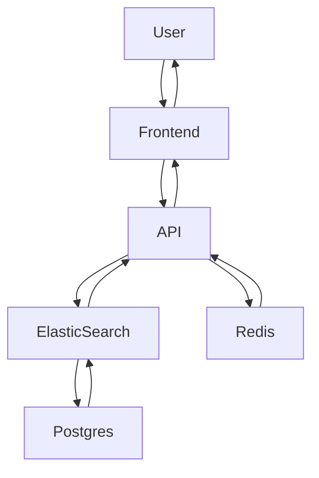

# System Diagram

## Flow Diagram



### Text-Based flow diagram

```text
User <-->  Frontend <--> API <--> ElasticSearch <--> Postgres (+pgvector)
              ^
              |
              V
            Redis
```

## FastAPI Data Class Structures

```python
class ArticleModel(metadata):
id = Column(Integer, primary_key=True, index=True)
title = Column(String)
title_embedding = Column(Vector(768))
body = Column(JSON)
body_embedding = Column(Vector(768))
authors = Column(String)
categories = Column(String)
image_url = Column(String)
embedding = Column(Vector(768))

class SearchRequest(BaseModel):
query: str
network: bool = False

class Article(BaseModel):
title: str
body: List[str]
authors: List[str]
categories: List[str]
image_url: str

class SearchResult(BaseModel):
article: Article
relevance_score: float

class NetworkNode(BaseModel):
id: str
group: int
title: Optional[str] = None
author: Optional[str] = None

class NetworkLink(BaseModel):
source: str
target: str
value: float

class NetworkData(BaseModel):
nodes: List[NetworkNode]
links: List[NetworkLink]

class APIResponse(BaseModel):
list: List[SearchResult]
```

## Endpoints

- /search/all
- /search/title
- /search/body
- /search/network

Current setup, will be condensed to a single endpoint with options for title/body, network option already implemented.
Network option returns nodes+links required for d3.js network graph. All endpoints follow the above class structure for storage and retrieval of data. ArticleModel shows how data is send and received from Postgres/ElasticSearch

## Containerisation

### Containers

- Redis
- ElasticSearch
- Postgres
- FastAPI

Single Shared Network
Docker-Compose to start/stop/control all containers
