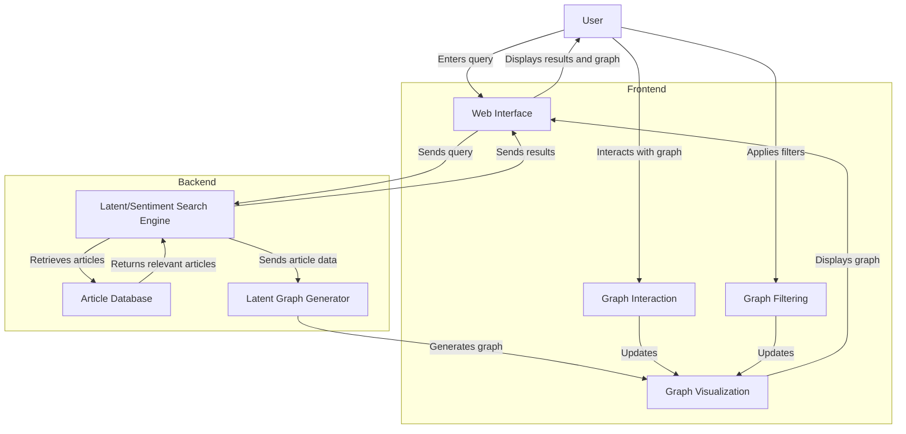

# System Diagram

```mermaid

graph TD

A[User] -->|Enters query| B[Web Interface]

B -->|Sends query| C[Latent/Sentiment Search Engine]

C -->|Retrieves articles| D[Article Database]

D -->|Returns relevant articles| C

C -->|Sends results| B

C -->|Sends article data| E[Latent Graph Generator]

E -->|Generates graph| F[Graph Visualization]

F -->|Displays graph| B

A -->|Interacts with graph| G[Graph Interaction]

G -->|Updates| F

A -->|Applies filters| H[Graph Filtering]

H -->|Updates| F

B -->|Displays results and graph| A


subgraph "Backend"

C

D

E

end


subgraph "Frontend"

B

F

G

H

end

```
